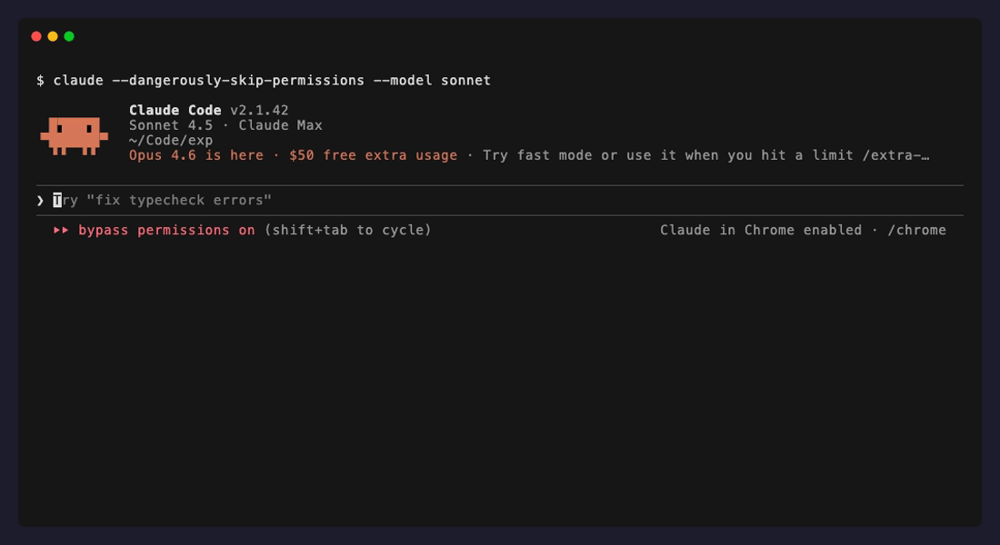

# exp - the missing primitive for orchestrating parallel AI agents.

Instant project branching via macOS APFS clonefile -- git worktrees but dumber and faster.

**[thebrubaker.github.io/exp](https://thebrubaker.github.io/exp/)**

[](https://github.com/thebrubaker/exp/actions/workflows/ci.yml)
[](https://github.com/thebrubaker/exp/releases/latest)
[](LICENSE)

<p align="center">
  
</p>

## Why

APFS copy-on-write cloning gives you a full project copy — `.env`, `.git`, `node_modules`, everything — in under a second with near-zero disk overhead. `exp` wraps this into a CLI that creates numbered branches, seeds them with context, and opens a terminal (for humans).

No shared state. No branch switching. No cleanup. Just branch, work, merge via git, trash.

## The unlock: AI agent orchestration

When Claude Code needs to work on three things at once, each agent needs its own isolated workspace. `exp` gives every agent a fully isolated branch — its own directory, its own git branch — zero conflicts, near-zero cost.

<p align="center">
  
</p>

```bash
# Claude dispatches three agents, each in their own branch
exp new "upgrade-turbo" --no-terminal    # Agent 1 → branch exp/upgrade-turbo
exp new "fix-ci" --no-terminal           # Agent 2 → branch exp/fix-ci
exp new "dark-mode" --no-terminal        # Agent 3 → branch exp/dark-mode

# Each agent commits, pushes, opens a PR. Your working branch is untouched.
```

No file collisions. No orchestrator needed to prevent conflicts. Each branch is a real git repo — agents push and merge via PR like any developer would.

## Also useful to humans!

If you've ever been in the middle of a task and wanted to quickly start a side-quest -- just run `exp new "try swapping in redis"` and you'll get a fast branch in a new terminal -- run claude and take it away.

## Install

```bash
brew install digitalpine/tap/exp
```

Or grab a binary from [releases](https://github.com/thebrubaker/exp/releases/latest):

```bash
curl -L https://github.com/thebrubaker/exp/releases/latest/download/exp-darwin-arm64 -o exp
chmod +x exp && sudo mv exp /usr/local/bin/exp
```

Requires macOS with APFS (the default since High Sierra).

## Quick start

```bash
exp init                          # One-time setup (terminal, editor, clean targets)
exp new "try redis caching"       # Branch + new terminal + git branch
# ...work freely...
exp trash 1                       # Done? Toss it.
```

## How it works

`exp` calls the macOS `clonefile(2)` syscall — an atomic copy-on-write clone of your entire project directory. Both copies share the same physical disk blocks until a file diverges, at which point only the changed blocks are duplicated.

```
~/Code/
  my-project/                    # Your original (untouched)
  .exp-my-project/
    001-try-redis/               # Branch 1 — own git branch, full isolation
    002-refactor-auth/           # Branch 2 — same deal
```

A 2GB project with `node_modules` clones in ~1 second and uses a few KB until you start changing files.

## Commands

| Command | Alias | Description |
|---------|-------|-------------|
| `exp new "desc"` | `n` | Branch project → git branch → open terminal |
| `exp ls` | `l`, `list` | List branches (with diverged size) |
| `exp diff <id>` | `d` | What changed vs original |
| `exp trash <id>` | `t`, `rm` | Delete branch |
| `exp open <id>` | `o` | Open terminal in branch |
| `exp cd <id>` | -- | Print path (`cd $(exp cd 3)`) |
| `exp status` | `st` | Project info |
| `exp nuke` | -- | Delete ALL branches |
| `exp home` | -- | Print original project path (from inside a branch) |
| `exp init` | -- | Interactive onboarding (terminal, editor, clean targets) |
| `exp clean-export` | `ce` | Remove Claude export files from project |

IDs are flexible: number (`1`), full name (`001-try-redis`), or partial match (`redis`).

Every branch automatically gets a git branch (`exp/<slug>`) so work is PR-ready from the start.

## Configuration

Create `~/.config/exp`:

```bash
terminal=ghostty          # ghostty | iterm | warp | tmux | terminal | none
open_editor=cursor        # Open editor after branching
clean=.next .turbo .cache # Delete these dirs post-clone (saves rebuild time)
```

| Variable | Config Key | Description |
|----------|------------|-------------|
| `EXP_ROOT` | `root` | Override branch storage location |
| `EXP_TERMINAL` | `terminal` | Terminal to open (auto-detected by default) |
| `EXP_OPEN_EDITOR` | `open_editor` | Editor to open in branch |
| `EXP_CLEAN` | `clean` | Dirs to delete after clonefile |

## Claude Code integration

`exp` was built for [Claude Code](https://docs.anthropic.com/en/docs/claude-code). Every branch gets:

- **CLAUDE.md seeding** — branch context (goal, diff/trash commands) prepended so Claude knows it's in a branch
- **Auto git branch** — `exp/<slug>` branch created automatically, ready for PR
- **TTY detection** — agents get `--no-terminal` behavior automatically (no terminal flood)
- **JSON output** — `exp new --json` returns structured data for programmatic use

```bash
# In Claude Code: /export
exp new "try redis caching"     # Export rides along with the branch
exp clean-export                # Remove export from original (branch keeps it)
```

## License

MIT
